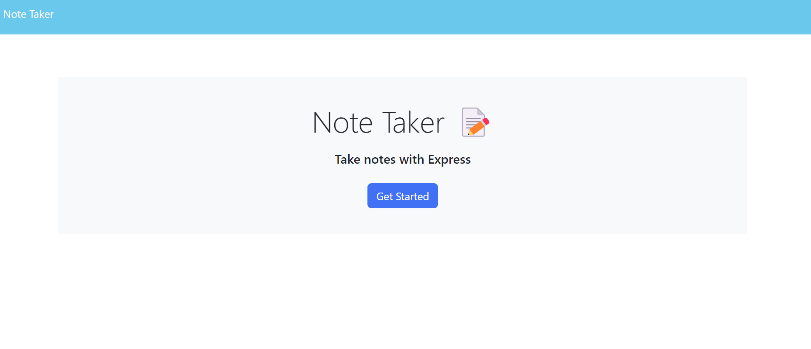
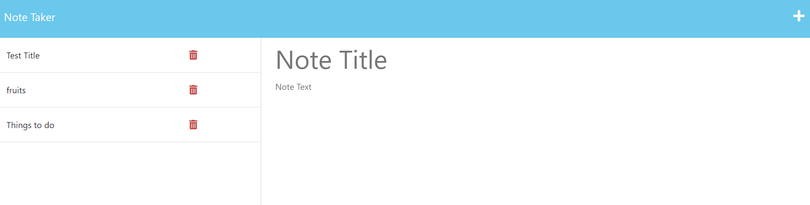

# Note Taker 

## Table Of Contents:

* Description
* Installation
* Usage
* Questions

# Description:
**A minimal and easy to use Note Taking Application that you can use on the go,an app that allows you to take notes and save notes.*

**With this Note App challenge, I was able to learn and implement how to work with methods such as GET, POST, And DELETE. and became more familiar with the backend*

# Installation
You can access the App using Heroku

https://jotdownnotes.herokuapp.com/

# Usage
*Input your title, jot down notes and save button available to save notes*

 *Live URL: https://jahazielfaye.github.io/Note-App/

 *GitHub URL: https://github.com/JahazielFaye/Note-App

# License
N/A

# Contributions
N/A

# Questions

-Any further questions regarding app. 
connect here --->

GitHub: https://github.com/JahazielFaye

Email: hazelponsaran@gmail.com

